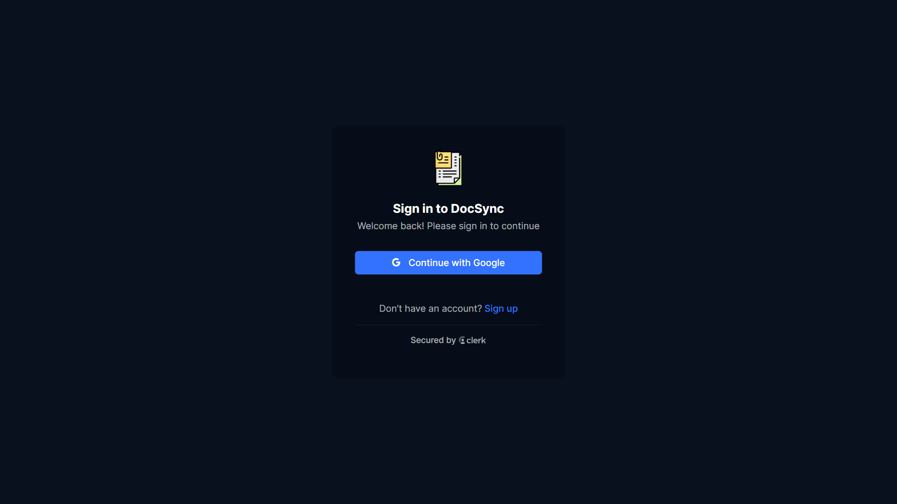
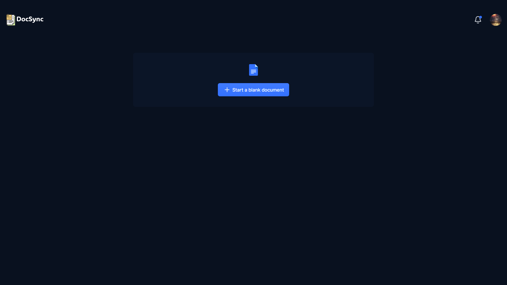
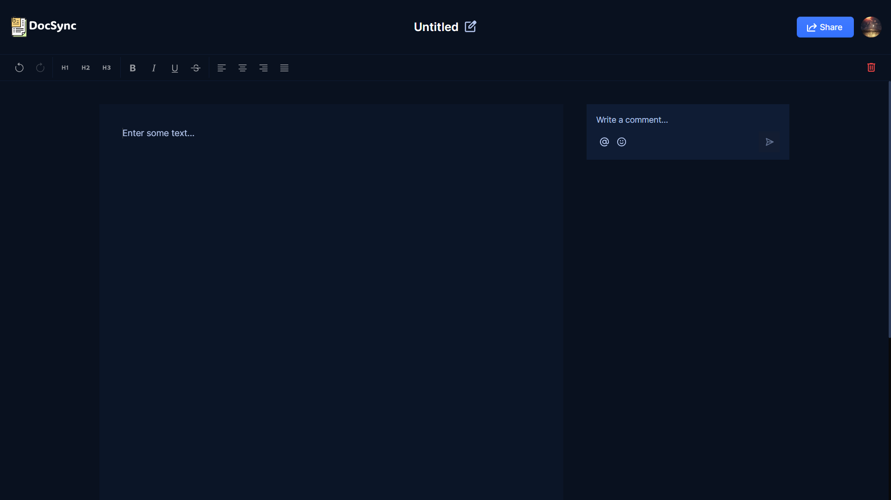
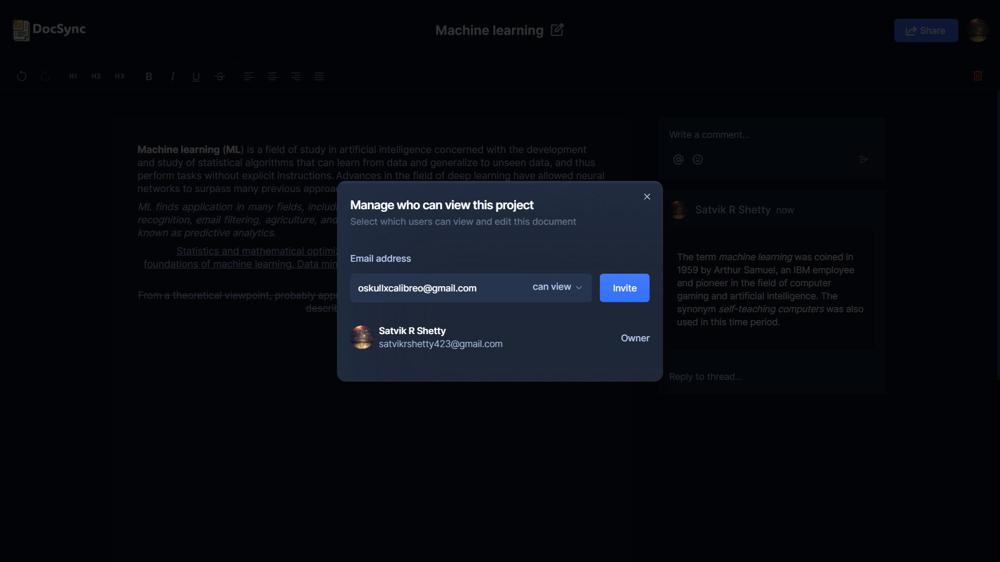
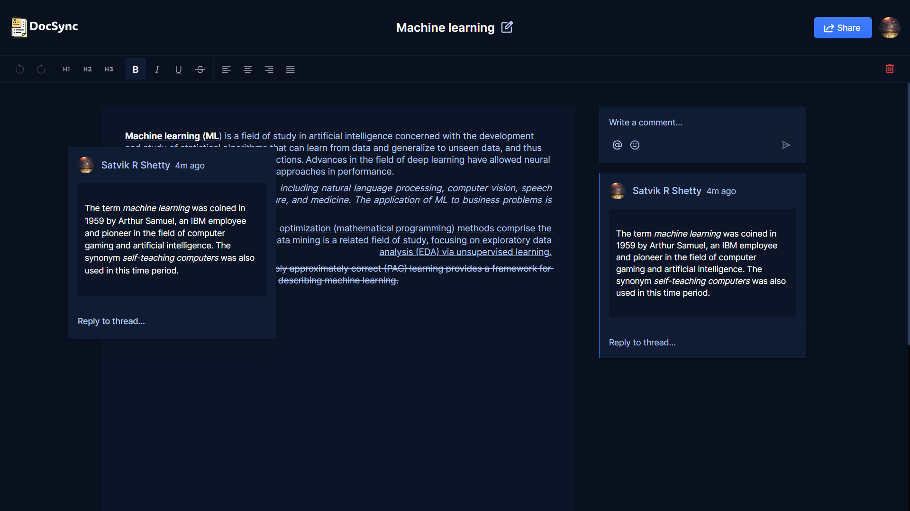
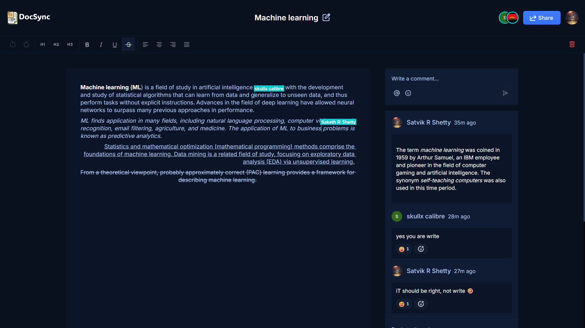
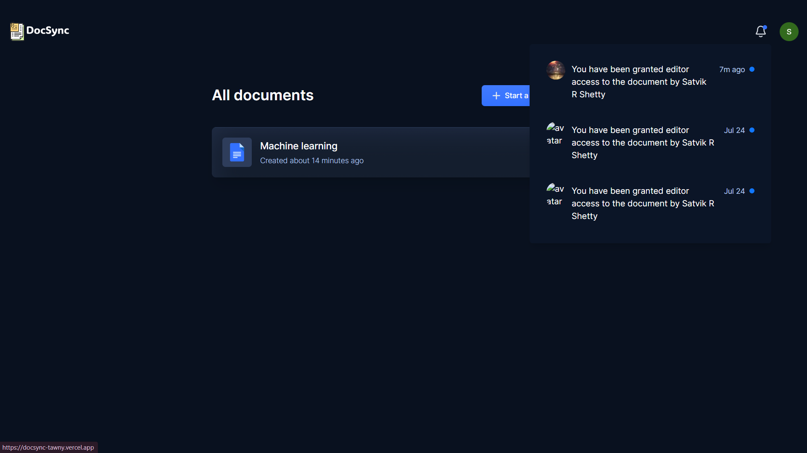
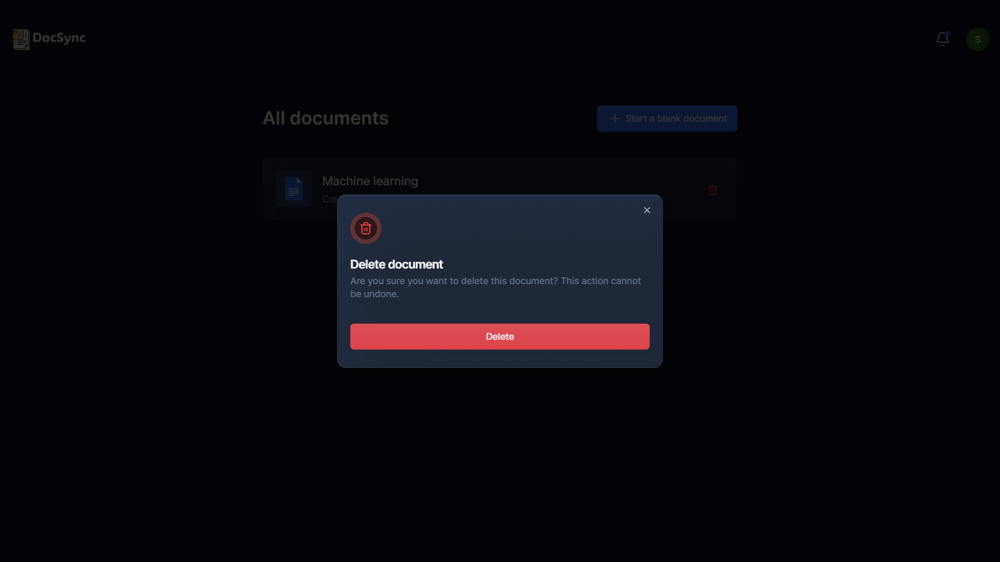

---

# DocSync

Welcome to DocSync, the ultimate solution for seamless real-time document collaboration. DocSync empowers users to create, edit, and share documents effortlessly, no matter where they are. With its intuitive interface and robust features, DocSync allows multiple users to work on the same document simultaneously, ensuring that everyone's contributions are captured in real time. 

## Features

### 🔐 Authentication
- **Google Authentication**: Secure sign-in and session management through NextAuth, allowing users to authenticate using their google accounts.

### ✍️ Collaborative Text Editor
- **Real-Time Collaboration**: Multiple users can edit the same document simultaneously with real-time updates, powered by Liveblocks and Lexical Editor.

### 📁 Document Management
- **Create Documents**: Easily create new documents, which are automatically saved and listed for quick access.
- **Delete Documents**: Users can delete documents they own.
- **Share Documents**: Share documents via email or link, with customizable view/edit permissions.
- **List Documents**: Display all documents owned or shared with the user, featuring search and sorting functionalities.

### 💬 Comments
- **Inline and General Comments**: Add comments directly in the text or general comments on the document.
- **Threaded Discussions**: Engage in threaded discussions for more organized communication.

### 👥 Active Collaborators
- **Real-Time Presence Indicators**: Display active collaborators in the text editor with real-time presence indicators.

### 🔔 Notifications
- **User Notifications**: Notify users of document shares, new comments, and collaborator activities.

### 📱 Responsive Design
- **Cross-Device Compatibility**: Enjoy a fully responsive application that works seamlessly across all devices.

## Technology Stack

- **Next.js**: A powerful React framework for building server-side rendered applications.
- **TypeScript**: A statically typed superset of JavaScript.
- **Liveblocks**: Real-time collaboration infrastructure.
- **Lexical Editor**: A text editor library for building rich text editors.
- **ShadCN**: A design system for consistent UI.
- **Tailwind CSS**: A utility-first CSS framework for rapid UI development.

## Screenshots

### Login Page

### Dashboard

### Editor

### Sharing

### Comments

### Collaboration
 

### Notifications

### Document deletion

## Contact

For any inquiries, please contact:
- **Name**: [Satvik R Shetty](mailto:satvikrshetty423@gmail.com)
- **LinkedIn**: [Satvik R Shetty](https://www.linkedin.com/in/satvik-r-shetty/)
- **GitHub**: [satvik423](https://github.com/satvik423)

---
Thank you for checking out DocSync!
